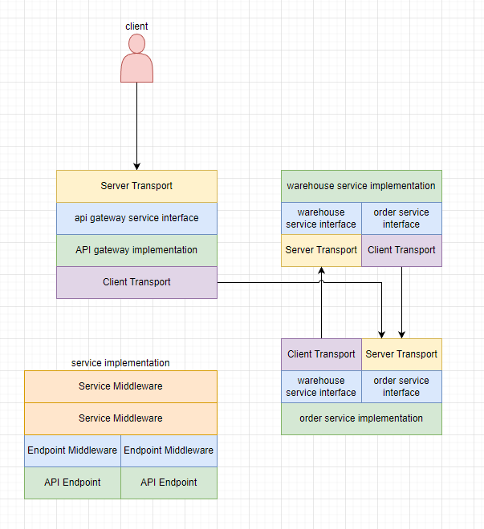

# JK

go-kit boilerplate code generator.

## Design Pattern



### seperated transportation layer

achieve transportation protocol independent. change transportation layer protocol as your wish.

### unified service interface both server side and client side

call all different rpc service in same way.

## usage

```bash
go run cmd/main.go -package github.com/nnnewb/jk/_example/stringsvc/service -service Service -outdir ./_example/stringsvc/service/
```
